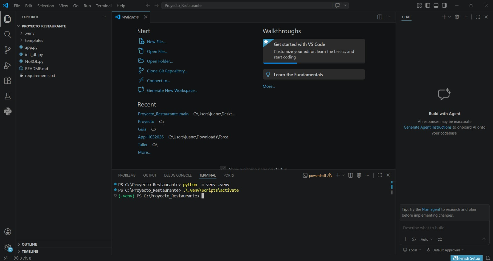
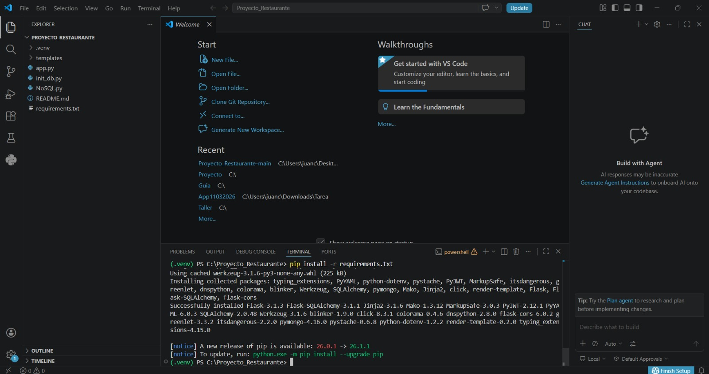
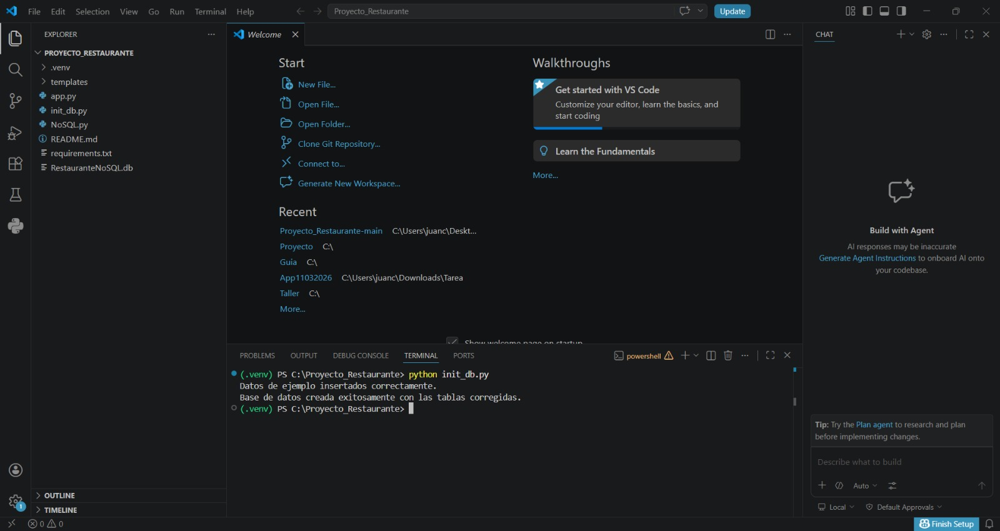
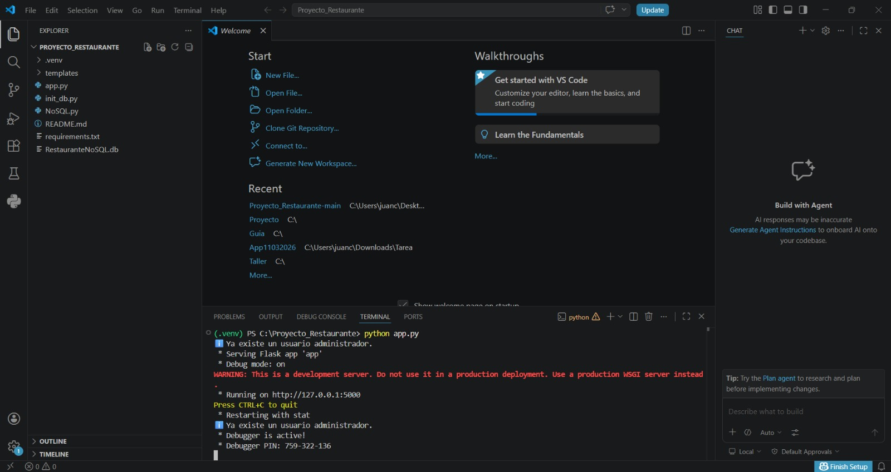
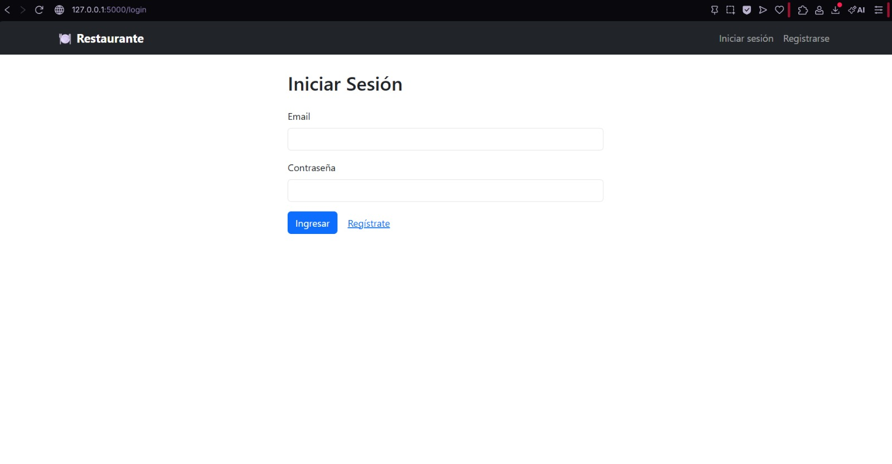
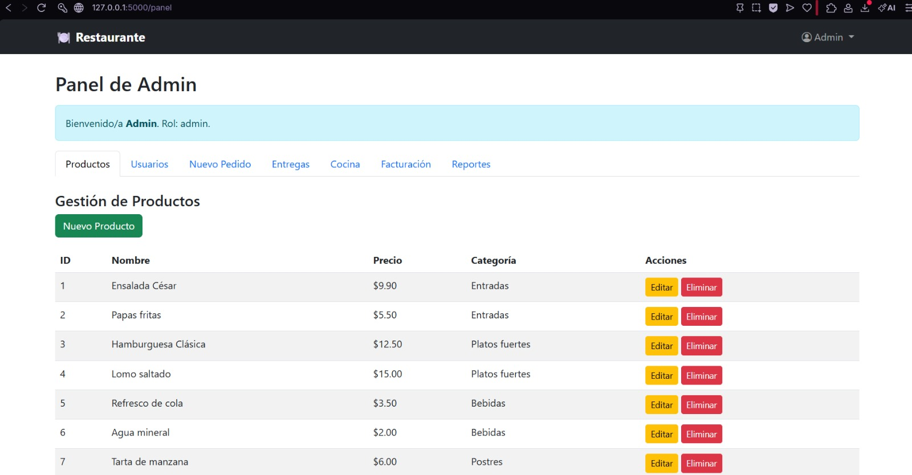
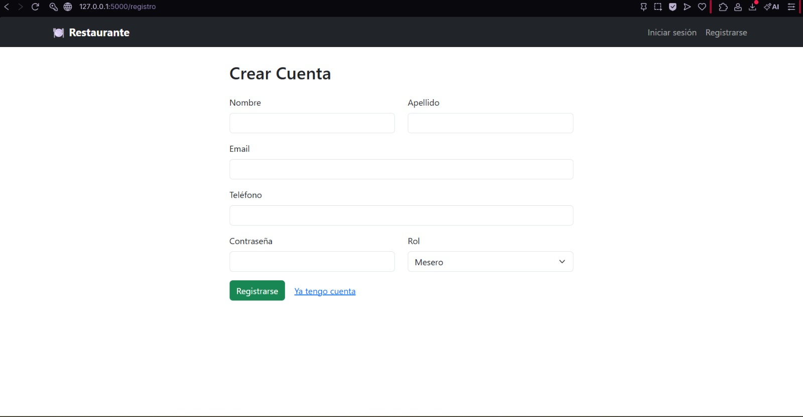
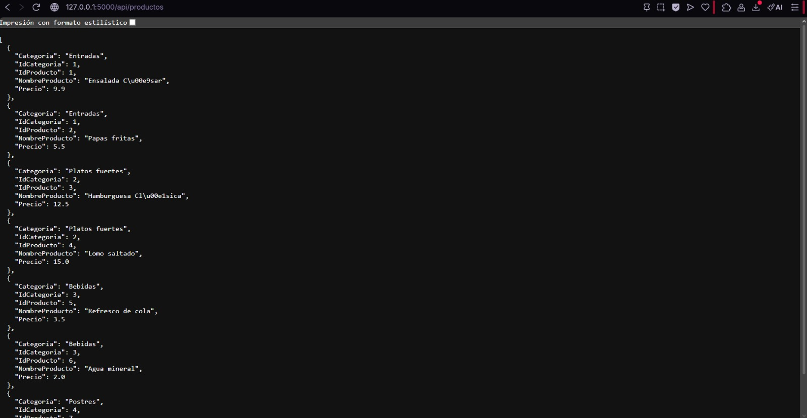
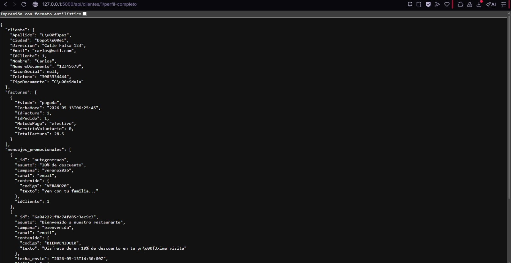

# Restaurante API

Diseñada para la gestión de pedidos, facturación, reportes y envío de mensajes promocionales en un restaurante. Desarrollada con Flask, SQLite (datos transaccionales) y una base de datos NoSQL (mensajes promocionales).

## Características

- Gestión de productos y categorías.
- Administración de mesas y su estado (libre, ocupada, en proceso de pago).
- Creación y seguimiento de pedidos con estado (pendiente, en preparación, listo, entregado, facturado).
- Facturación con servicio voluntario y registro de pagos.
- Reportes de ventas por rango de fechas (ingresos totales, platos más vendidos).
- Almacenamiento de mensajes promocionales enviados a clientes (ofertas, newsletters, notificaciones) en base NoSQL.

## Tecnologías

- Python 3.8+
- Flask
- Flask-SQLAlchemy
- SQLite (base de datos relacional)
- Base de datos NoSQL documental (MongoDB)
- Flask-CORS
- JWT & Bcrypt
- Postman

## Instalación y ejecución local

1. Crear y activar un entorno virtual  
   bash
   python -m venv venv
   venv\Scripts\activate
   

2. Instalar dependencias  
   bash
   pip install -r requirements.txt
   

3. Ejecutar el archivo `init_db.py`  
   bash
   python init_db.py
   

4. Ejecutar el archivo `app.py`  
   bash
   python app.py
   

5. Probar las distintas rutas definidas en la app.py
   /login
   /registro
   /panel
   
   
   

7. Probar los endpoints  
   Puedes usar Postman para probar los diferentes endpoints.
   

   **Ejemplos de peticiones**
   - Listar todos los productos  
     `GET http://127.0.0.1:5000/api/productos`
   - Crear un nuevo producto  
     `POST http://127.0.0.1:5000/api/productos`  
     Body (JSON):
     json
     {
       "nombre": "Pizza Margarita",
       "precio": 12.99,
       "id_categoria": 1
     }
     

## Base de datos NoSQL para mensajes promocionales

Además de la base relacional, el sistema usa una base NoSQL para almacenar el historial de mensajes promocionales enviados a los clientes. Esto permite manejar grandes volúmenes de datos y esquemas flexibles sin afectar el rendimiento de las operaciones transaccionales.
Para hacer uso de esta herramienta, ejecutar el archivo NoSQL.py por pasos. 
Dentro de este, están las secciones de conexión y CRUD con la base de datos no relacional.

### Estructura del documento NoSQL

- **Identificador único** –
- **idCliente** – referencia al cliente en la base relacional.
- **Canal** – email, SMS, WhatsApp, etc.
- **Campaña** – nombre de la promoción (ej. `descuento_verano`).
- **Asunto** – título o texto corto del mensaje.
- **Contenido** – objeto flexible con texto, enlaces, códigos de descuento, etc.

### Ejemplo de documento

json
{
  "_id": "m001",
  "idCliente": 123,
  "canal": "email",
  "campana": "verano2026",
  "asunto": "20% de descuento",
  "contenido": {
    "texto": "Ven con tu familia...",
    "codigo": "VERANO20"
  }
}

  
